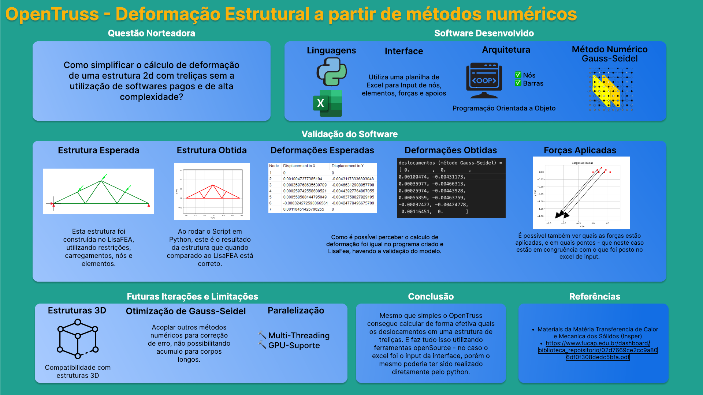

# 2D-Truss-FEA
"OpenTruss" simulation group project for the Heat Transfer and Solid Mechanics discipline taught at Insper.

## Files
The project contains several files that work together to perform the analysis:

- FEA.py: This is the main file that should be run to execute the software. It orchestrates the entire analysis process and calls other necessary functions and classes.

- input/: This folder contains input files in Excel format. These files define the truss structure by specifying nodes, bars, locked axis information, sectional area, and longitudinal modulus of elasticity for each element.

- funcoesTermosol.py: This file contains input and plotting functions. It provides utilities to read input data from the Excel files and plot the results of the analysis.

- trelica.py: This file defines the classes for nodes and elements used in the analysis. It encapsulates the properties and behavior of truss nodes and elements.

- jacobi.py and gauss.py: These files contain numerical method functions used by the solver. They implement the Jacobi and Gauss methods for solving linear equations encountered during the analysis.

- resultados.txt: This file stores the output of the program. It contains the calculated node displacements and element tensions resulting from the finite element analysis.

## Usage
To use the 2D Truss Finite Element Analysis Software, follow these steps:

1. Ensure that Python 3 is installed on your system.

2. Download or clone the project repository.

3. Install any required dependencies specified in the project's documentation.

4. Place the input Excel files in the input/ folder. Make sure the files contain the necessary information for defining the truss structure.

5. Run the FEA.py file using Python 3. This will initiate the finite element analysis process.

6. When running, the program will read the coded input file, plot the truss structure and specified loads, and then perform the finite element analysis using 4 different methods. The analysis process may take a minutes to complete depending on the size of the truss structure.

7. Once the analysis is finished, you can find the results in the resultados.txt file. This file contains the node displacements and element tensions.